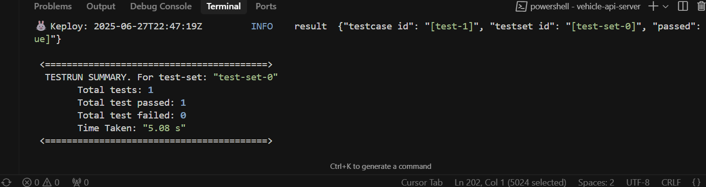
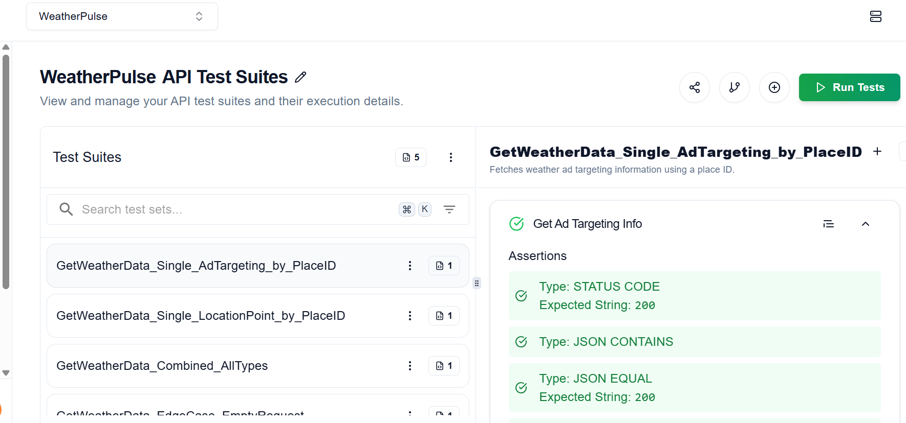
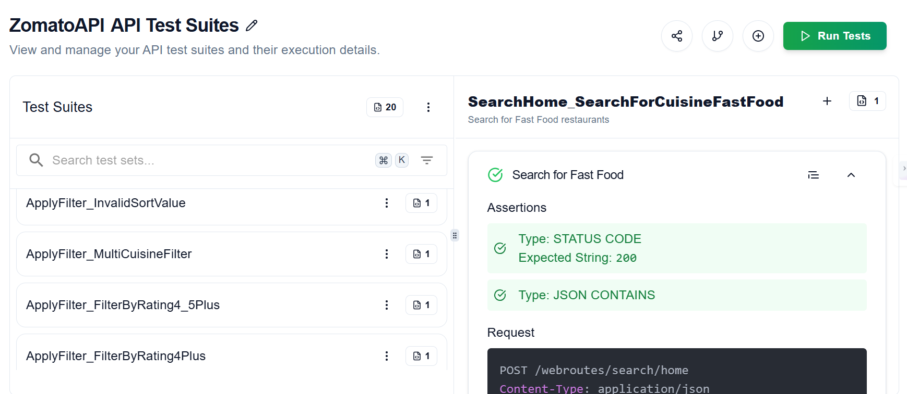

# 🚗 Vehicle Flow API

A RESTful API for managing vehicle data — built using **Express.js**, **MongoDB**, and tested using **Jest**, **Supertest**, and **mongodb-memory-server**.

---

## 🛠 Tech Stack

- **Backend Framework**: Express.js  
- **Database**: MongoDB (via Mongoose)  
- **Environment Variables**: dotenv  
- **Testing**: Jest, Supertest, mongodb-memory-server  
- **Code Coverage**: Jest with built-in coverage tools  
- **AI Testing**: [Keploy](https://keploy.io/)  
- **Documentation**: Swagger (OpenAPI)

---

## 📦 Project Structure

vehicle-api-server/
│
├── app.js # Express app logic & routes
├── server.js # App runner
├── models/
│ └── Vehicle.js # Mongoose schema
├── tests/
│ ├── api/ # API endpoint tests
│ │ └── vehicle.api.test.js
│ ├── integration/ # API + DB integration tests
│ │ └── vehicle.integration.test.js
│ └── unit/ # Unit tests (controller logic)
│ └── vehicleController.test.js
├── .env # MongoDB connection string
├── jest.config.js
└── package.json

yaml
Copy
Edit

---

## 🚀 How to Run Locally

### 1. Clone the Repository

```bash
git clone https://github.com/prakharrrrrrsingh/Vehicle-flowapi.git
cd Vehicle-flowapi/vehicle-api-server
npm install
2. Start the Server
bash
Copy
Edit
npm start
🧪 Running Tests
This project uses Jest for:

✅ Unit Tests
✅ API Endpoint Tests (with Supertest)
✅ Integration Tests using in-memory MongoDB

✅ Test Coverage
Achieved over 88%+ test coverage including unit, API, and integration tests.

📸 Test Coverage Screenshot:


📋 API Endpoints
Method	Endpoint	Description
GET	/api/vehicles	Get all vehicles
GET	/api/vehicles/:id	Get a vehicle by ID
POST	/api/vehicles	Add a new vehicle
PUT	/api/vehicles/:id	Update a vehicle
DELETE	/api/vehicles/:id	Delete a vehicle

## 📊 Keploy Test Report



## 🌐 Chrome Extension API Testing

  



🤝 Contribution
Pull requests are welcome for improvements and suggestions.

📢 About
This project was built as part of a backend testing assignment to implement:

Unit Tests

Integration Tests

End-to-End API Testing

AI-Powered Testing with Keploy

OpenAPI Documentation

CI/CD Pipeline Integration

📬 Contact
Made by Prakhar Singh

📧 Email: prakhar6122@gmail.com
🔗 LinkedIn
💻 GitHub

yaml
Copy
Edit

---

### ✅ Now What?

1. **Push this `README.md` to GitHub**
   ```bash
   git add README.md
   git commit -m "Finalized README with Keploy AI Test details"
   git push origin main
